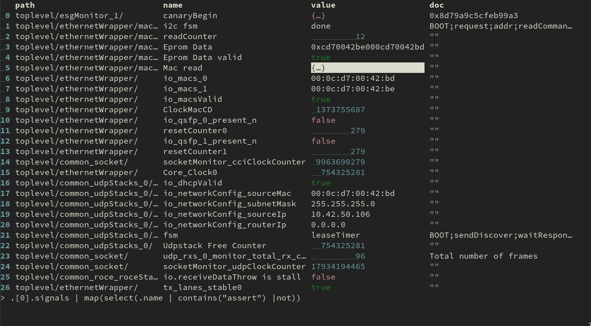

# Tabular Json EXplorer

Navigate through complex json files by interactively building up a [jq](https://jqlang.org) filter.



## Usage

```shell
tjex example.json
```

If no file is given, `tjex` will try to read json from stdin.
You will start out at the prompt at the bottom of the table.
Enter a `jq` filter and the table will immediately update to show its output.
Use `M-o` to switch to interactive navigation through the table.
Exit with `C-g`.

In the table view, you can navigate using the arrow keys and use `<return>` to descend into the currently selected cell.
Use `ESC` or `C-_` to undo prompt changes.

For a full list of hotkeys, look at the example configuration in `~/.config/tjex/config.toml` which is automatically generated upon first invocation of tjex.

## Installation

### Requirements

* [python](https://www.python.org) __≥3.12__
* [jq](https://jqlang.org) __≥1.7__
* If [atuin](https://atuin.sh) is available, the current prompt can be appended to the history with `M-<return>`.

### With pipx

```shell
pipx install git+https://github.com/knapheide/tjex.git
```

## Configuration

The default location for the configuration file is `~/.config/tjex/config.toml`.
An example configuration is automatically created when tjex is run for the first time.

### Key bindings

Key bindings can be customized as illustrated in the example configuration.

Key names are taken from the curses library's `keyname` function.
To find the name of a key, press it in tjex and watch the log output:

```shell
# In one terminal:
tjex --logfile=tjex.log []
# In another terminal:
tail -f tjex.log
# Now in the first terminal, press the desired key and look for a line of the form
# DEBUG:tjex:key='...'
```

## Alternatives

* [jless](https://github.com/PaulJuliusMartinez/jless)
  is a command-line json viewer that basically displays the indented and syntax-highlighted json file.
  To get a better overview of the structure, individual objects and arrays can be collapsed or expanded.
* [jnv](https://github.com/ynqa/jnv) provides an interactive jq prompt together with a jless-style viewer.
  However, the prompt is not updated when browsing through the viewer.
* [fx](https://fx.wtf/getting-started) has an interactive mode with a prompt.
  This prompt appears to be limited to path expressions and only influences the cursor position in the displayed json file.
* [nushell](https://www.nushell.sh)'s [explore](https://www.nushell.sh/book/explore.html) command displays data in a tabular form similar to tjex.
  It has a `:try` sub-command that provides a nushell prompt.

## TODO
* Separate persistent command history for TextEditPanel
* Mini history just for the table view
  * ESC to go one level up / return to the prompt
* Multi-line cells
* Kill ring for TextEditPanel
* Transpose `TablePanel` (without changing the underlying data)
* Configurable number formatting
* Raw view
* Better demo picture / animation in README
* Per-panel dirty flag
* Status message animation (for pending jq process)
* Nix flake
* Plain-text search in table
* Publish to PyPI
* CI
* When applying transformations, try to keep the cursor position
